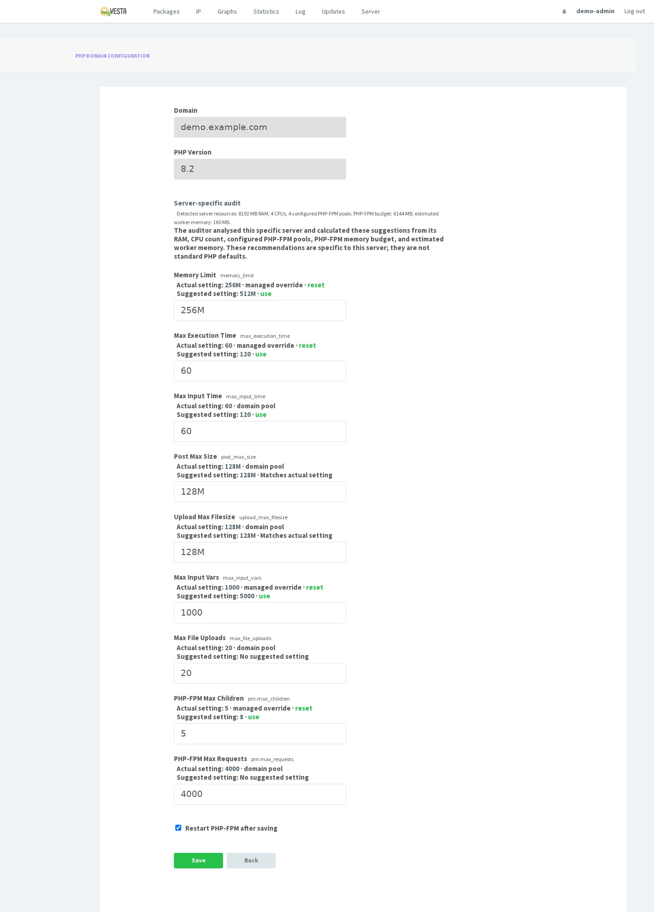
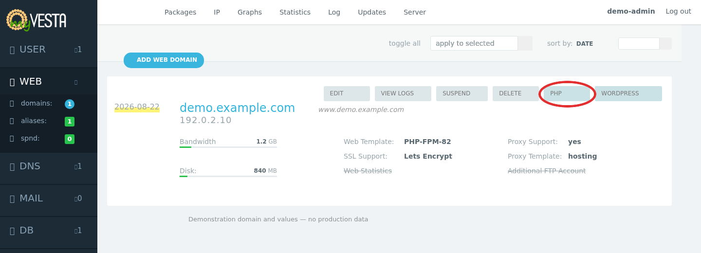

# myVesta Domain PHP Config

[](CHANGELOG.md)
[](#project-status)
[](https://myvestacp.com/)
[](docs/compatibility.md)
[](#compatibility)
[](LICENSE)

Installable, domain-level PHP-FPM configuration for existing
[myVesta](https://myvestacp.com/) servers. It extends the panel in place; it does
not require a myVesta reinstall and does not replace the control panel.

The extension adds a native-style **PHP** action to every web-domain row,
immediately before **WordPress**. Administrators and domain owners can inspect the
effective PHP settings, compare them with suggestions calculated specifically for
that server, and save validated per-domain overrides.

> [!IMPORTANT]
> There is no published GitHub release yet. Clone the repository or download the
> ZIP from GitHub, inspect the source, and run the installer locally. Do not install
> it through an unaudited `curl | bash` command.

## Quick start

Clone the public repository and run the preflight before installing:

```bash
mkdir -p "$HOME/src"
cd "$HOME/src"
git clone https://github.com/tts-empire/myvestacp-domain-php-config.git
cd myvestacp-domain-php-config
sudo ./install.sh --dry-run
sudo ./install.sh
sudo /usr/local/vesta/bin/v-check-domain-php-config-patch
```

Read the detailed [download](#download) and [installation](#installation)
sections before using this on a production server.

## Features

- Native myVesta-style page and domain-list action for administrators and users.
- Separate **Actual setting** and **Suggested setting** values.
- Suggestions based on the server's RAM, CPU count, PHP-FPM pools and safety
  reserve; they are not generic PHP defaults.
- Per-domain PHP and PHP-FPM overrides stored outside generated pool files.
- Automatic reapplication after myVesta rebuilds web-domain configuration.
- Transactional validation, rollback and at most one PHP-FPM restart per save.
- Installer preflight, conflict detection and timestamped backups.
- No changes to any global `php.ini`.

## Screenshot

### Domain PHP-FPM settings

[](docs/assets/domain-php-config.png)

### PHP action in the WEB domain list

[](docs/assets/domain-list-php-action.png)

Both screenshots are rendered from the actual myVesta templates and stylesheet
using fully synthetic documentation data. They contain no production domain,
hostname, account name, IP address or measured server value. The red outline is a
documentation annotation and does not appear in the installed panel.

## Project status

Version `0.1.0` is a beta build already deployed on a real myVesta server. Debian
10, 11 and 12 are included in the compatibility matrix, but myVesta versions and
locally modified panel templates can differ. Always run the preflight before the
installer.

There is currently no tagged GitHub release or packaged `.deb`. Installation uses
a repository checkout. Keep that checkout in its original location: the current
uninstaller uses the installed manifest to locate the original reverse patches.

## Compatibility

| Component | Requirement |
| --- | --- |
| Operating system | Debian 10, 11 or 12 |
| Control panel | An existing myVesta installation |
| myVesta root | `/usr/local/vesta` by default |
| PHP | One or more PHP-FPM versions under `/etc/php/<version>/fpm` |
| Required commands | `bash`, `patch`, `flock`, standard GNU/Linux utilities |
| Permissions | `root` or an account with working `sudo` access |

PHP versions are discovered from the server and from myVesta's domain PHP helper;
the extension does not hardcode PHP 8.1 or 8.2. Debian 13 is not currently claimed
as supported. See the complete [compatibility matrix](docs/compatibility.md).

## Download

Choose one method. Run the download as your normal administrative account and use
`sudo` only for the installation commands.

### Option A: clone with Git (recommended)

Clone the repository into a stable directory that will not be deleted after
installation:

```bash
mkdir -p "$HOME/src"
cd "$HOME/src"
git clone https://github.com/tts-empire/myvestacp-domain-php-config.git
cd myvestacp-domain-php-config
```

### Option B: download the ZIP from GitHub

1. Open the repository on GitHub.
2. Select **Code → Download ZIP**.
3. Copy the ZIP to the myVesta server with SFTP or `scp`.
4. Ensure `unzip` is installed, extract the archive into a permanent directory and
   enter the project folder:

```bash
mkdir -p "$HOME/src"
unzip myvestacp-domain-php-config-main.zip -d "$HOME/src"
mv "$HOME/src/myvestacp-domain-php-config-main" \
  "$HOME/src/myvestacp-domain-php-config"
cd "$HOME/src/myvestacp-domain-php-config"
```

If GitHub gives the extracted folder a different suffix, use that actual folder
name in the `mv` command. Do not remove the final project directory after the
installation.

## Installation

### 1. Run the non-destructive preflight

From the project directory:

```bash
sudo ./install.sh --dry-run
```

The preflight checks the operating system, required myVesta commands and whether
the integration patches can be applied or are already present. A successful run
ends with:

```text
Preflight OK: no files changed
```

If it reports `patch conflict`, stop. Do not force the patch: the installed
myVesta templates differ from the supported dialect and require compatibility
review.

### 2. Install the extension

```bash
sudo ./install.sh
```

The installer will:

1. create a timestamped backup under
   `/var/lib/myvesta-domain-php-config/backups/`;
2. install the PHP configuration commands and panel page;
3. add the PHP action to the administrator and user domain lists;
4. add the reapply hook to myVesta's web-domain rebuild command;
5. preserve managed domain settings under
   `/var/lib/myvesta-domain-php-config/domains/`.

The final output prints the exact backup directory created for that run.

For a non-standard myVesta installation, pass its root explicitly:

```bash
sudo VESTA_ROOT=/custom/vesta ./install.sh --dry-run
sudo VESTA_ROOT=/custom/vesta ./install.sh
```

### 3. Verify the installation

```bash
sudo /usr/local/vesta/bin/v-check-domain-php-config-patch
```

The command exits with status `0` when all required checks pass. Review every
`WARN` or `FAIL` before using the configuration page.

### 4. Open the page in myVesta

1. Sign in to myVesta as an administrator or domain owner.
2. Open **WEB**.
3. Locate the required domain.
4. Select **PHP**, immediately before the **WordPress** action.
5. Review **Actual setting** and **Suggested setting** before saving.

Suggested values are calculated from the resources detected on that specific
server. They are editable recommendations and are never applied automatically.

## Managed settings

| PHP setting | Purpose |
| --- | --- |
| `memory_limit` | Per-request PHP memory ceiling |
| `max_execution_time` | Maximum script execution time |
| `max_input_time` | Maximum request input parsing time |
| `post_max_size` | Maximum POST body size |
| `upload_max_filesize` | Maximum uploaded file size |
| `max_input_vars` | Maximum number of request input variables |
| `max_file_uploads` | Maximum simultaneous uploaded files |
| `pm` | PHP-FPM process-manager mode |
| `pm.max_children` | Maximum concurrent workers for the domain |
| `pm.max_requests` | Requests handled before recycling a worker |

Saving multiple fields is one transaction. The extension validates the generated
pool configuration before restarting the corresponding PHP-FPM service and rolls
back the pool and saved state if validation or restart fails.

## Updating

For a Git checkout, update the source and run the same preflight before upgrading:

```bash
cd "$HOME/src/myvestacp-domain-php-config"
git pull --ff-only
sudo ./upgrade.sh --dry-run
sudo ./upgrade.sh
sudo /usr/local/vesta/bin/v-check-domain-php-config-patch
```

For a ZIP installation, download and extract the new version over a separate
temporary directory, copy its contents into the permanent project directory, and
then run the three `upgrade.sh` and verification commands above. Do not delete the
permanent directory or change its path between install and uninstall.

Each installation or upgrade creates a new timestamped backup before changing the
panel.

## Command-line usage

The web interface is the normal entry point. The installed CLI commands are useful
for automation and diagnosis:

```bash
# Inspect saved and effective values
sudo /usr/local/vesta/bin/v-list-domain-php-config example.com json

# Calculate server-specific suggestions without applying them
sudo /usr/local/vesta/bin/v-suggest-domain-php-config example.com json

# Change one value and restart the matching PHP-FPM service
sudo /usr/local/vesta/bin/v-change-domain-php-config \
  example.com memory_limit 512M yes

# Apply several changes atomically and reset one override
sudo /usr/local/vesta/bin/v-update-domain-php-config \
  example.com yes \
  set memory_limit 512M \
  set pm.max_children 8 \
  reset max_input_vars
```

Use `no` instead of `yes` only when an external maintenance procedure will validate
and restart PHP-FPM afterward.

## Uninstalling

Run the uninstaller from the same permanent checkout used for installation:

```bash
cd "$HOME/src/myvestacp-domain-php-config"
sudo ./uninstall.sh
```

The extension code and integration patches are removed. Per-domain state is
deliberately retained under `/var/lib/myvesta-domain-php-config/domains/`, allowing
it to be restored after a reinstall. Timestamped backups also remain available.

## Safety notes

- Back up the server or create a provider snapshot before modifying a production
  control panel.
- Run `--dry-run` after every myVesta update and before every extension upgrade.
- Never force a failed patch or overwrite a locally modified panel template.
- The extension changes per-domain FPM pools; it does not edit global `php.ini`
  files.
- Resource suggestions are planning estimates, not guaranteed or kernel-enforced
  limits.

## Documentation

- [Architecture](docs/architecture.md)
- [Compatibility matrix](docs/compatibility.md)
- [Changelog](CHANGELOG.md)

## Support and contributions

Use the repository's GitHub Issues section for reproducible bugs and compatibility
reports. Include the Debian release, myVesta version or commit, enabled PHP-FPM
versions, the preflight output and the verification output. Remove hostnames,
credentials and other private server data before posting.

Pull requests should preserve myVesta's existing visual and command conventions,
remain compatible with the supported Debian matrix, and include relevant static or
transaction tests.

## License

This project is licensed under the
[GNU General Public License v3.0 or later](LICENSE), consistently with the
myVesta/VestaCP codebase it extends.
